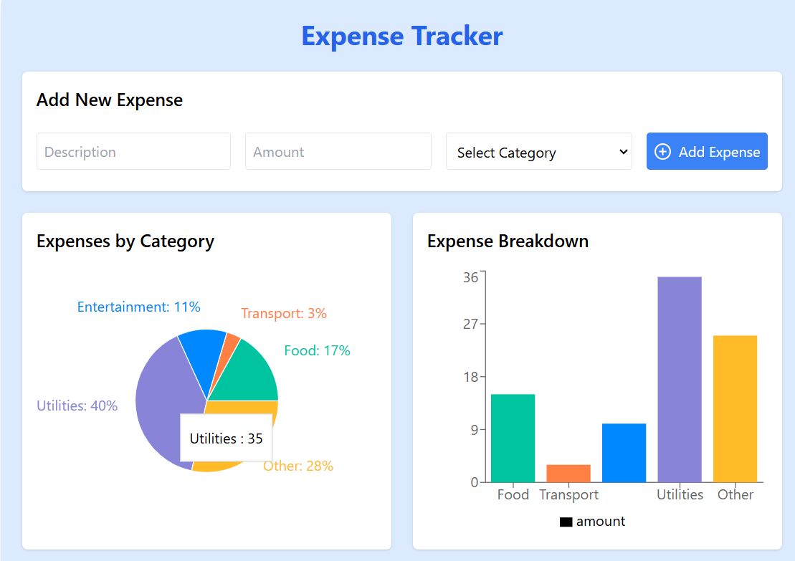
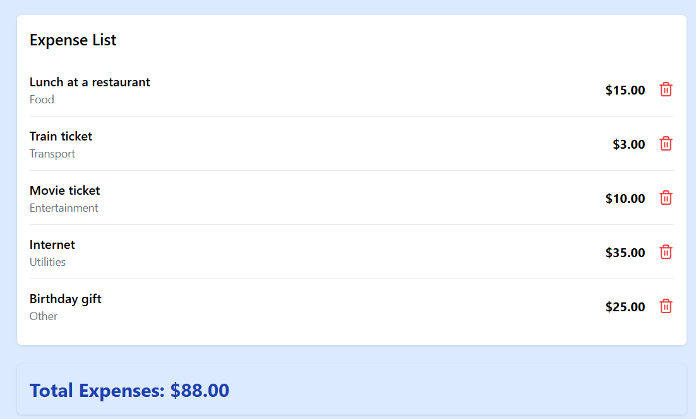

# Expense Tracker

# Modern Expense Tracker

A React-based expense tracking application with interactive visualizations and real-time updates. 

Built with React, Recharts, and Tailwind CSS.

## ScreenShots

<div style="display:flex;">

 

</div>


## Features

- Interactive pie and bar charts for expense visualization
- Real-time expense tracking and categorization
- Clean, responsive UI with Tailwind CSS
- Efficient state management
- Mobile-friendly design
- Toast notifications for user actions

## Installation

1. Clone the repository
```bash
git clone https://github.com/devCosimo/expense-tracker.git
```

2. Install dependencies
```bash
cd expense-tracker
npm install
```

3. Run the development server
```bash
npm run dev
```

## Dependencies

- React
- Recharts
- Lucide React
- Tailwind CSS

## Contributing

Pull requests are welcome. For major changes, please open an issue first to discuss what you would like to change."# Expense Tracker"
